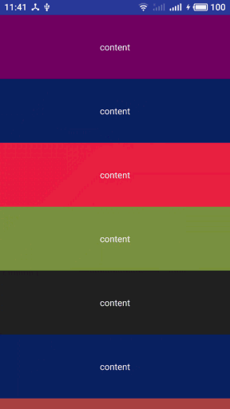
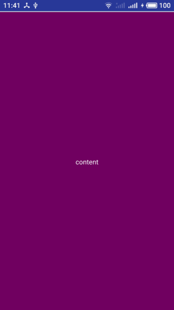

# 下拉刷新库

### 基本介绍
####  android原生下拉刷新库，支持给各种原生控件添加下拉刷新,默认仿新浪微博下拉刷新，同时也支持自定义下拉刷新头部动画，这是第一个版本，基本功能已实现，后面我会持续完善该库

可滚动view的下拉刷新

不可滚动view的下拉刷新

### 如何使用

#### Android Studio

第一步：在项目的gradle里配置

      allprojects {
        repositories {
            ...
            maven { url 'https://jitpack.io' }
        }
      }

第二步：在module的gradle里配置

     dependencies {
         compile 'com.github.shajinyang:SPayUtil:1.0.0'
     }

### 使用示例

#### 基本用法
布局：将刷新布局嵌套在需要刷新的控件外面，可以设置背景色

     <com.sjy.ui.pulltorefresh.PullToRefreshLayout
            android:layout_width="match_parent"
            android:layout_height="match_parent"
            android:background="#efefef"
           />

方法：

    void refresh();//刷新

    void closeRefresh();//停止刷新

    //刷新监听
    void setOnRefreshListener(new IOnRefreshListener() {
                     @Override
                     public void onRefresh() {
                        //todo   你自己的刷新逻辑
                     }
                 });

#### 自定义下拉刷新头部

默认的下拉刷新效果是类似于新浪微博的简洁风格，你也可以自定义自己的下拉头部

自定义的方法也很简单

    第一步：创建一个类继承RefreshHeaderAdapter 并根据自己需要的view动画效果重写相应的方法即可
            相关重写方法说明：
            void pullDistance(int dis);//下拉距离回调
            int getRefreshHeight();//设置刷新高度
            void onRefresh() ;//正在刷新回调
            autoRefresh();//自动刷新回调
            finishRefresh();//刷新结束回调
            View inflateHeaderView(Context context) ;//设置headView

    第二步：调用 PullToRefreshLayout的setAdapter进行设置;

以默认刷新头部完整源码为例

（1）自定义头部

    public class CommonHeaderAdapter extends RefreshHeaderAdapter {

        private ImageView iv;
        private TextView tv;
        private ProgressBar progressBar;
        private boolean isRefresh=false;//是否刷新
        private int refreshHeight=200;//刷新高度

        //下拉距离的回调
        @Override
        public void pullDistance(int dis) {
            dealScroll(dis);
        }

        //设置刷新高度
        @Override
        public int getRefreshHeight() {
            return refreshHeight;
        }

        //正在刷新时回调
        @Override
        public void onRefresh() {
            tv.setText("正在加载数据");
            iv.setVisibility(View.GONE);
            progressBar.setVisibility(View.VISIBLE);

        }
        //自动刷新回调
        @Override
        public void autoRefresh() {
            tv.setText("正在加载数据");
            iv.setVisibility(View.GONE);
            progressBar.setVisibility(View.VISIBLE);
        }

        //完成刷新回调
        @Override
        public void finishRefresh() {
            iv.setRotation(0);
            iv.setVisibility(View.VISIBLE);
            progressBar.setVisibility(View.GONE);
            tv.setText("下拉刷新");
        }

        //初始化下拉刷新头部view
        @Override
        public View inflateHeaderView(Context context) {
            View view=LayoutInflater.from(context).inflate(R.layout.view_header,null);
            iv=view.findViewById(R.id.iv);
            tv=view.findViewById(R.id.tv);
            progressBar=view.findViewById(R.id.progress_bar);
            return view;
        }

        /**
         * 处理下拉 头部事件
         * @param dis
         */
        private void dealScroll(int dis){
            if(Math.abs(dis)>refreshHeight){
                if(!isRefresh) {
                    tv.setText("松开加载");
                    ObjectAnimator.ofFloat(iv, "rotation", 0, -180)
                            .start();
                    isRefresh = true;
                }
            }else {
                if(isRefresh) {
                    tv.setText("下拉刷新");
                    ObjectAnimator.ofFloat(iv, "rotation", -180, 0)
                            .start();
                    isRefresh = false;
                }
            }
        }
    }

（2）在activity里初始化相关逻辑

    PullToRefreshLayout refreshView=findViewById(R.id.refresh_view))

    refreshView.setAdapter(new CommonHeaderAdapter());//设置自定义头部

    refreshView.setOnRefreshListener(new IOnRefreshListener() {
        @Override
        public void onRefresh() {

           //todo

        }
    });

